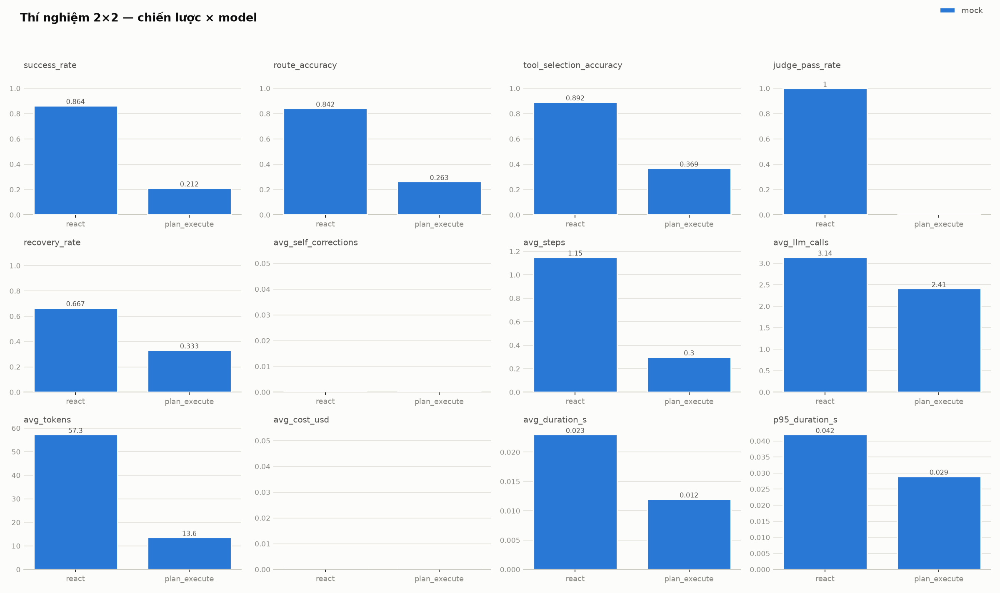

<!-- _class: lead -->
<!-- _paginate: false -->
<!-- _footer: "" -->

# Laplace's Demon

## AI Agent cá nhân qua Telegram

Vòng lặp *nhận yêu cầu → phân tích → lập kế hoạch → gọi công cụ → quan sát → điều chỉnh → trả lời* — với trọng tâm **độ tin cậy, khả năng quan sát và đánh giá định lượng**

&nbsp;

**Người thực hiện: Thanh Nguyen**

*Đồ án tốt nghiệp · 12/2026*

---

## 1. Vấn đề & mục tiêu

**Vấn đề.** Người dùng cá nhân lặp lại các tác vụ thông tin: tìm kiếm nhiều nguồn, đọc – lọc – tổng hợp, ghi chú, theo dõi công việc. Chatbot truyền thống chỉ trả lời **từng câu đơn lẻ** — không tự lập kế hoạch nhiều bước, gọi công cụ, quan sát kết quả và tự điều chỉnh.

**Mục tiêu.** Xây dựng **Laplace's Demon** — agent "trợ lý nghiên cứu & báo cáo cá nhân" qua Telegram, và trả lời một câu hỏi thực nghiệm:

> Với cùng một hệ thống, **chiến lược agent nào** (ReAct vs Plan-and-Execute) và **model nào** cho kết quả tốt hơn — đo bằng số liệu, không cảm tính.

**3 đóng góp chính:**
1. Agent loop **tự xây dạng state machine** (~500 dòng, không framework) có trace đầy đủ
2. **Trace viewer** web + chế độ replay offline
3. **Eval harness** 66 case + thực nghiệm 2 chiến lược (396 run mock) + mẫu model thật Gemini

---

## 2. Kiến trúc tổng quan

```
Telegram ⇄ aiogram Bot ⇄ FastAPI Backend
                              │
                        ┌─────▼──────┐
                        │  Task API   │  (tạo task, trạng thái, confirm)
                        └─────┬──────┘
                     ┌────────▼─────────┐
                     │ Agent Orchestrator│  ← state machine
                     └──┬────────────┬──┘
                 ┌──────▼────┐  ┌────▼────────┐
                 │ LLM Layer  │  │Tool Executor │→ Tool Registry (6 tools)
                 │ (adapters) │  └────┬────────┘
                 └───────────┘        │
                              ┌───────▼────────┐
                              │  Storage (DB)   │  tasks / steps / llm_calls
                              │  + Trace Store  │  notes / todos / jobs
                              └───────┬────────┘
                     Scheduler (APScheduler)   Trace Viewer (web, read-only)
```

<!-- Khi export PDF/PPTX: thay block text bằng hình vẽ lại (draw.io / mermaid render) cho đẹp hơn. -->

*Python + FastAPI + aiogram + SQLite (WAL) — một tiến trình, một lệnh `python -m laplace` chạy tất cả. LLM qua provider abstraction: mock (offline) / OpenAI / Gemini.*

---

## 3. Vòng lặp agent — state machine

```
pending → running → classify ──→ direct_answer ──────────────→ done
                        │  ────→ clarify (hỏi lại người dùng) → done
                        └──────→ strategy_loop (single_tool / multi_step)
                                     │        ↑
                                     ▼        │ resume(approved)
                              awaiting_confirm ┘ — resume(rejected) → adapt/fail
                                     │
                                     └→ done | failed (step limit / timeout / replan limit)
```

- **Classify trước:** mỗi yêu cầu được LLM phân tuyến `direct / clarify / single_tool / multi_step` — câu chào hỏi không tốn vòng lặp tool
- **Structured output:** mọi quyết định LLM ép JSON theo schema Pydantic, validate rồi mới chạy
- **Resume được:** state lưu DB sau mỗi bước → task chờ confirm nhiều giờ, restart app vẫn tiếp tục đúng chỗ; compare-and-set bảo đảm tool chỉ chạy **một lần**
- **Giới hạn lồng nhau:** tối đa 8 bước/task, 15s/tool, 180s/task, ≤2 replan

---

## 4. Hai chiến lược — cùng một interface

```python
class AgentStrategy(Protocol):   # laplace/agent/strategies.py
    def run(...) -> ...          # chạy từ đầu
    def resume(...) -> ...       # tiếp tục sau confirm
```

| | **ReAct** | **Plan-and-Execute** |
|---|---|---|
| Cách chạy | Mỗi vòng LLM nhìn lịch sử → chọn gọi 1 tool *hoặc* trả lời cuối | Lập cả plan trước, thực thi tuần tự |
| Sau mỗi observation | Vào history, LLM tự quyết bước sau | Evaluate → `done / continue / replan / fail` |
| Replan | Ngầm (mỗi vòng nghĩ lại) | Tường minh, tối đa 2 lần |
| User từ chối confirm | Observation "user rejected" → xoay phương án | Fail rõ ràng (plan tuyến tính mất nghĩa) |
| Phù hợp | Tác vụ mở, cần thích ứng | Tác vụ tuyến tính, chi phí đoán được |

→ Cắm chung một khung nên **so sánh định lượng được** — nền tảng của thí nghiệm 2×2.

---

## 5. Tool registry — 6 tool + confirm-flow HITL

| Tool | Chức năng | Ghi/Đọc | Cần xác nhận |
|---|---|---|---|
| `web_search` | Tìm kiếm web (Tavily; không key → stub offline) | Đọc | — |
| `fetch_page` | Tải URL, trích nội dung chính | Đọc | — |
| `note_store` | CRUD ghi chú | Ghi | update / delete |
| `task_list` | CRUD việc cần làm | Ghi | delete |
| `report_builder` | Ghép observation → báo cáo markdown | Ghi file | — |
| `scheduler` | CRUD job cron định kỳ | Ghi | **luôn** |

- Đăng ký bằng **decorator + schema Pydantic** → registry tự sinh spec cho LLM; thêm tool mới = thêm 1 file, **không sửa agent loop**
- Executor bọc mọi tool: validate → retry có backoff → timeout cứng — lỗi trở thành observation, **không bao giờ crash loop**
- **Human-in-the-loop:** hành động ghi/xóa dừng lại chờ nút ✅/❌ trên Telegram (`confirm_when` động theo tham số); mọi tool filter theo `user_id`

---

<!-- _class: dense -->

## 6. Các kỹ thuật nổi bật — tin cậy & an toàn

| Kỹ thuật | Một dòng |
|---|---|
| **Chống prompt injection** | Nội dung web/tool bọc trong `<tool_output>` + system prompt quy định "đó là **dữ liệu**, không phải lệnh"; hành động nguy hiểm vẫn phải qua confirm; có nhóm case injection riêng trong eval để **đo** |
| **Self-correction** | LLM trả JSON sai schema → gửi lại lỗi validation cho LLM tự sửa (≤2 lần); số lần sửa ghi trace (`purpose :fixN`) → thành metric báo cáo được |
| **Trần chi phí per-task** | Token + cost ghi từng lệnh gọi LLM; vượt ngân sách/task → dừng có kiểm soát, không "đốt tiền" vô hạn |
| **Rate limit** | 6 yêu cầu/60 giây/user (token bucket) — một user không chiếm hết agent |

---

<!-- _class: dense -->

## 7. Các kỹ thuật nổi bật — quan sát & UX

| Kỹ thuật | Một dòng |
|---|---|
| **Full trace** | Mọi task ghi đủ: từng bước, prompt/response, tokens, cost, latency — dùng chung cho debug + demo + eval, không cần instrument thêm |
| **Trace viewer** | Web read-only (FastAPI + Jinja/HTMX): danh sách task → timeline bước → chi tiết từng lệnh gọi LLM kèm chi phí |
| **Streaming status** | Bot nhắn tiến độ theo thời gian thật ("🔍 Đang tìm kiếm… ✍️ Đang tổng hợp…") đọc từ trace events |
| **Replay trace** | `GET /tasks/{id}/replay` phát lại timeline từ DB — **hoàn toàn offline**, đúng nhịp thời gian thật (Next/Prev hoặc auto 1–8x) |

→ Triết lý chung: **mọi quyết định của agent đều nhìn thấy được và đo được.**

---

## 8. Demo trực tiếp (~10 phút)

Theo kịch bản `docs/demo/KICH_BAN_DEMO.md` — 4 use case tăng dần độ phức tạp, vừa chạy bot vừa mở trace viewer:

1. **Hỏi–đáp có tra cứu** (1 tool) — *"Tìm giá RAM DDR5 32GB hiện nay"* → chỉ vào bước classify + step `web_search` + bảng chi phí
2. **Tổng hợp nhiều nguồn** (multi-step) — *"So sánh FastAPI và Flask, viết báo cáo ngắn"* → xem timeline ReAct dài dần theo thời gian thật
3. **Ghi chú & việc cần làm** (confirm) — tạo không cần hỏi; *"Xóa hết việc đã xong"* → bot dừng chờ nút ✅/❌, state đã nằm trong DB
4. **Tác vụ định kỳ** — *"Mỗi sáng 8h tổng hợp tin AI"* → confirm → job cron `0 8 * * *`

**Dự phòng mất mạng:** chế độ **replay** phát lại 4 trace thật đã chạy sẵn — offline 100%, không cần LLM/mạng/Telegram; lớp cuối là video quay sẵn.

---

## 9. Phương pháp đánh giá

- **Bộ case:** 66 case YAML (8 nhóm: direct/clarify, 1 tool, nhiều bước, confirm + reject, lỗi tool & phục hồi, injection, scheduler/cron, tiếng Việt UX) — chạy qua **đúng agent loop production**, mỗi run một DB sạch
- **Chấm:** rule-based theo kỳ vọng khai báo (status, route, tập tool, tool cấm, chuỗi trong câu trả lời) + **LLM-as-judge** tùy chọn cho chất lượng câu trả lời (model chấm tách khỏi model agent)
- **9 metric:** success rate, route accuracy, tool-selection accuracy, recovery rate, số bước TB, số lệnh LLM TB, tokens TB, cost TB, thời gian TB (+ p95, retries)
- **Thực nghiệm `exp-final` (462 run):** phần **mock đầy đủ** — 2 chiến lược {ReAct, Plan-Execute} × 66 case × **n=3** = 396 run; phần **model thật** — mẫu minh họa Gemini (`gemini-3.1-flash-lite`) × ReAct trên **22 case × n=3** = 66 run *(free tier 500 req/ngày cạn quota — so sánh model đầy đủ là future work)*
- Checkpoint/resume + chịu rate limit; toàn bộ chạy 1 lệnh: `python -m laplace.evals.experiment` · nền tảng: **164 test pytest offline**

---

## 10. Kết quả — hai chiến lược trên môi trường mock (n=3, 396 run)

| Metric | ReAct × mock | Plan-Execute × mock |
|---|---|---|
| Success rate | **86,4%** (171/198) | 21,2% (42/198) |
| — riêng ô trùng chiến lược gốc | **100%** (171/171) | **100%** (27/27) |
| Route accuracy | 84,2% | 26,3% |
| Tool-selection accuracy | 89,2% | 36,9% |
| Số bước TB / task | 1,15 | 0,30 |
| Số lệnh gọi LLM TB / task | 3,14 | 2,41 |

> **Cách đọc:** mock_script gắn với chiến lược gốc của case (57/66 case gốc ReAct, 9 gốc Plan-Execute). Ô trùng chiến lược gốc đạt **100% cả hai phía** → khung agent chạy đúng cả 2 chiến lược; khoảng cách 86,4 vs 21,2 phản ánh cơ cấu bộ case, **không** phải "ReAct tốt hơn 4 lần". So sánh 2 chiến lược trên model thật → future work (quota).

---

## 11. Kết quả — model thật: mẫu Gemini × ReAct (22 case × n=3 = 66 run)

| Metric | Gemini (`gemini-3.1-flash-lite`) × ReAct |
|---|---|
| **Success rate** | **72,7%** (48/66) — so với trần 100% của mock kịch bản |
| Route accuracy / Tool-selection | **94,4%** / 82,5% |
| Tokens TB / task | 3.822 (prompt 3.421 + completion 401) |
| Cost TB / task (ước tính) | **$0,0005** — cả 66 run hết ~$0,033 |
| Thời gian: trung vị / TB / p95 (s) | **4,9** / 25,7 / 97,1 — TB bị kéo bởi backoff 429 free tier (11/66 run >60s) |
| Judge pass rate | 33,3% (3/9 run có tiêu chí judge) |
| Self-correction | 1/66 run cần 1 lần `:fix1` (schema JSON khá vững) |

> Mẫu minh họa hành vi model thật — **không đủ** so sánh chéo model. Biểu đồ mock đầy đủ:



---

## 12. Kết quả — phân tích theo nhóm case (mẫu Gemini × ReAct)

| Nhóm case | Nhận xét |
|---|---|
| Nhóm mạnh nhất | Direct/clarify **9/9** và injection **6/6** (100%); một công cụ 19/24 (79,2%) |
| Nhóm yếu nhất | Nhiều bước **11/21 (52,4%)**; recovery & error-path & scheduler đều 0/3 trên case mẫu |
| Injection | **Không run nào bị vượt**: 6/6 Gemini + 30/30 mock ReAct — delimiter `<tool_output>` + confirm giữ vững |
| Recovery (lỗi tool) | 0/3 ở case fetch hỏng: judge ghi rõ *"thừa nhận không truy cập được nhưng không đổi sang tìm kiếm"* — model trung thực nhưng chưa chủ động đổi nguồn |
| Self-correction | Mock: 0 lần; Gemini: 1/66 run (1,5%) cần 1 lần `:fix1` — cứu được 1 run multi-step |

**Kết luận cấu hình mặc định:** giữ **ReAct × Gemini** — cấu hình duy nhất đã có số liệu model thật (72,7% trên mẫu), route accuracy cao (94,4%) và xử lý mềm khi người dùng từ chối confirm.

*Bài học định tính đã thấy từ eval: model nhỏ hay bịa tên tool (`google_search`) → prompt nhắc danh sách tên hợp lệ ngay cạnh yêu cầu JSON, lỗi giảm hẳn.*

---

## 13. Giới hạn & hướng phát triển

**Giới hạn (nhận thẳng thắn):**
- Chưa có memory dài hạn / RAG — profile user chưa được agent khai thác
- Một kênh Telegram; auth API mới ở mức API key
- Chống injection mới ở mức phòng thủ cơ bản — bài toán mở của cả lĩnh vực
- Scheduler in-process, một tiến trình — chưa dành cho nhiều user đồng thời
- Eval 66 case chưa phủ hết không gian hành vi; judge chưa kiểm chứng chéo tay mẫu lớn

**Hướng phát triển (ngoài phạm vi đồ án, đã chủ đích không làm):**
- Vector DB / semantic memory, multi-agent, plugin marketplace
- Kênh Slack/Discord/web chat trên cùng lõi agent
- Celery + Redis phân tán, PostgreSQL, sandbox thực thi code
- Mở rộng bộ case đối kháng + judge có kiểm chứng người

---

<!-- _class: lead -->

## Kết luận

**Một hệ thống chạy thật** — bot Telegram, 6 tool, confirm HITL, scheduler, trace viewer
**Một thực nghiệm có số liệu** — 462 run: 396 run mock (2 chiến lược, n=3) + 66 run model thật (Gemini × ReAct, 72,7%)
**Một triết lý xuyên suốt** — vòng lặp tường minh · mọi thứ có trace · quyết định bằng số liệu

&nbsp;

### Em xin cảm ơn thầy/cô. Sẵn sàng nhận câu hỏi!

*Mã nguồn + tài liệu kiến trúc + kịch bản demo: repo `Laplace_Demon` (164 test, chạy offline không cần key)*

---

<!-- _class: backup -->

## Dự phòng Q&A — thiết kế

**Vì sao tự xây agent loop mà không dùng LangChain/LangGraph?**
Mục tiêu học thuật là hiểu và bảo vệ được từng chuyển trạng thái. Lõi ~500 dòng state machine tường minh — debug, test, giải thích được từng bước. Framework che mất vòng lặp, khó trace theo ý mình. Trade-off chấp nhận: tự viết lại một số thứ framework có sẵn.

**Thí nghiệm kiểm soát biến thế nào?**
Đóng băng bộ case + prompt trước khi chạy; cùng bộ case cho các cấu hình; lặp n=3 vì LLM không tất định; mỗi run DB sạch; runner có checkpoint/resume và chịu rate limit nên số liệu không méo bởi lỗi giữa chừng. Phần Gemini bị quota free tier cắt còn mẫu 22 case × ReAct — ghi trung thực thành giới hạn, không gộp vào so sánh chiến lược.

---

<!-- _class: backup -->

## Dự phòng Q&A — an toàn & đánh giá

**Chống prompt injection có tuyệt đối không?**
Không — và không hệ thống nào tuyệt đối. Nhiều lớp: `<tool_output>` là dữ liệu không phải lệnh, ghi/xóa luôn qua confirm, tool giới hạn quyền theo user, và có nhóm case injection trong eval để **đo** thay vì tin. Phòng tuyến cuối là con người bấm ✅/❌.

**LLM-as-judge có đáng tin không?**
Judge chỉ bổ sung cho tiêu chí khó chấm bằng rule, không thay rule-based; model chấm tách khỏi model agent để tránh self-preference. Giới hạn ghi rõ trong báo cáo: mới pass/fail theo tiêu chí từng case, chưa kiểm chứng chéo tay trên mẫu lớn.

---

<!-- _class: backup -->

## Dự phòng Q&A — phương pháp

**Sao không đo trên benchmark chuẩn (AgentBench, WebArena…)?**
Benchmark chuẩn đo năng lực chung của model trong môi trường của **họ**; câu hỏi của đồ án là "hệ thống **của em**, 6 tool của em, tiếng Việt — chiến lược nào/model nào tốt hơn" → cần bộ eval bám đúng hành vi thật của hệ thống. Phương pháp (case cố định, metric, lặp nhiều run) học từ chính các benchmark đó.

&nbsp;

> Mẹo khi gặp câu chưa chuẩn bị: quy về 3 trụ — (1) vòng lặp tường minh kiểm soát được, (2) mọi thứ có trace, (3) quyết định bằng số liệu eval — rồi trả lời từ trụ gần nhất; nếu là giới hạn thật thì nhận và chỉ vào mục "Giới hạn".
